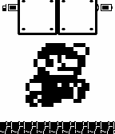

# Mario Watchface for Pebble Classic and Pebble Time
_by Denis Dzyubenko and Alexey Avdyukhin_

Mario jumps every minute.

 

Based on a concept by Denis Dzyubenko:
https://github.com/shadone/pebble-mario

Which based on a concept by Habib:
http://www.mypebblefaces.com/view?fID=290&aName=Habib&pageTitle=MarioTime&auID=265

Download: [mario.pbw](mario.pbw?raw=true)

Animation:

## Licence

Copyright (C) 2013 Denis Dzyubenko

This program is free software; you can redistribute it and/or
modify it under the terms of the GNU General Public License
as published by the Free Software Foundation; either version 2
of the License, or (at your option) any later version.

This program is distributed in the hope that it will be useful,
but WITHOUT ANY WARRANTY; without even the implied warranty of
MERCHANTABILITY or FITNESS FOR A PARTICULAR PURPOSE.  See the
GNU General Public License for more details.

You should have received a copy of the GNU General Public License
along with this program; if not, write to the Free Software
Foundation, Inc., 51 Franklin Street, Fifth Floor, Boston, MA  02110-1301, USA.

You may contact the author at denis@ddenis.info
